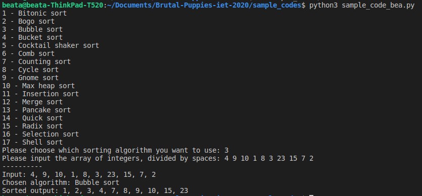

# Projekt megismerése, egyszerű példakód írása a library felhasználásával

Ahhoz, hogy megértsem és megismerjem ezt a library-t, először a README fájlt olvastam el, ahol a fejlesztői összefoglalták a legfontosabb tudnivalókat róla: hogyan kell teszteket futtatni és installálni a használathoz. Továbbá az implementált algoritmusok és fel vannak itt sorolva, nagyon jó áttekintést nyújt így ezekről, nem kellett az összes fájlt végigolvasni ahhoz, hogy tisztában legyek, milyen algoritmusokat lehet használni a segítségével. 

## Példakód
Egy példakód megírását választottam ahhoz, hogy még jobban elmélyítsem a tudásom a projekttel kapcsolatban. Ez egy egyszerű futtatható python fájl, ami lehetővé teszi, hogy a különböző sorbarendezési algoritmusokat kipróbálhassa a felhasználó. 

Két bementet vár a program futás közben, először az algoritmust kell kiválasztani a felsoroltak közül, majd pedig a számsorozatot kell megadni szóközökkel elválasztva, amelyet sorba szeretnénk rendeztetni. 

Az algoritmus lefutása után kiírja nekünk a konzolablakra a sorba rendezett számokat. 

#### Futtatás:
`python3 sample_code_by_bea.py`

#### Eredménye:
