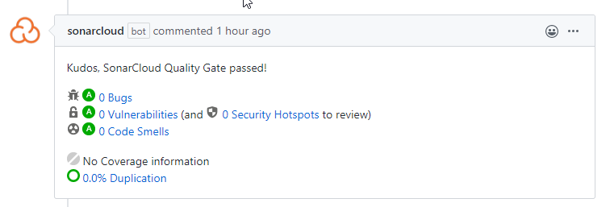

# Technológia fókusz
# Fix Sonar Cloud Bugs 
# Unreachable Code

## Miután Südi Beáta hozzá adta a projektunkhöz a Sonar Cloudot, több helyen is Bugot jelzett. Például a projekt maths könyvtárában több helyen unreachable code-ot jelzett. 

A _diffie_hellman_key_exchange.py_, _find_primitve_root_simple.py_ és a _find_order_simple.py_ fájlokban több helyen a return után voltak kommentek, amiket a SonarCloud elérhetetlen kódoknak jelzett. 

A saját gépemen lokálisan a SonarLint segítségével könnyen megtaláltam a hibákat és további kisebb hibákat is majd mindet kijavítottam az érintett fájlokban. 

## A pusholás után a SonarCloud duplikált kódrészleteket talált a könyvtárban, így nem fogadta el a változtatást. 

A _diffie_hellman_key_exchange.py_ és a _find_primitve_root_simple.py_ is felhasznált függvényeket a _find_order_simple.py_ és az _euler_totient.py_ fájlokból, importálás helyett duplikálással. Kitöröltem az érintett függvényeket és megvalósítottam az importálást. 

Ezek után a SonarCloud is elfogadta a változtatásokat. 

