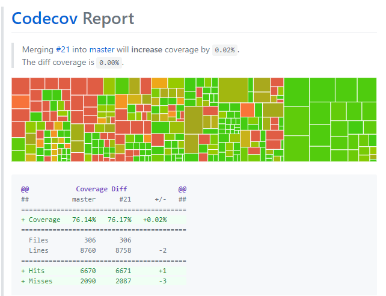
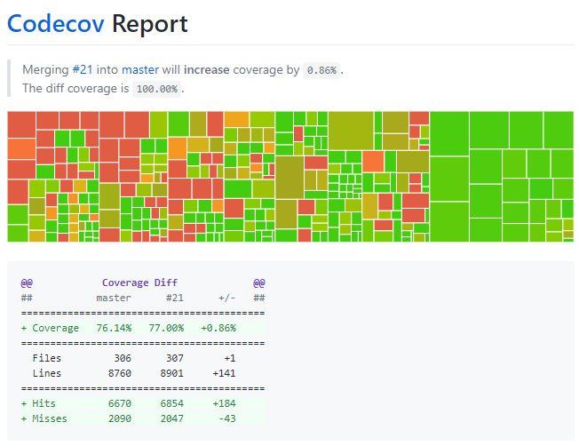
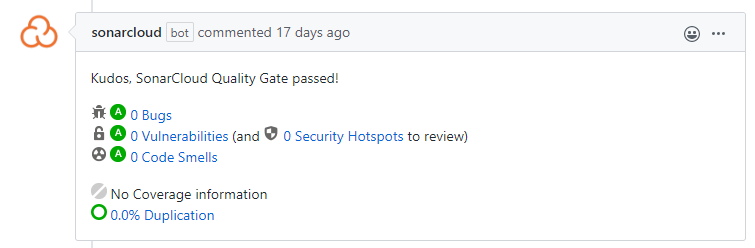

# Technológia fókusz
# Fix Sonar Cloud Bugs 
# Function returns should not be invariant

### A Sonar Cloud projektünkbe való integrálása után az eszköz rengeteg hibát fedett fel. 

Ezek átnézése után a komolyabbakkal kezdtem foglalkozni, hiszen a SonarCloud kettőt is Blocker-ként tüntetett fel. Ilyen volt a 
**Function returns should not be invariant** bug, amely két fájlban is előfordult.

A hibák megtalálásában lokálisan a SonarLint segített.

### Az első a `cocktail_shaker_sort.py` függvényben volt, amely array-ek rendezésére alkalmas.
A bugot az okozta, hogy a 
while ciklusban egy esetben visszatértünk a tömbbel, ami a függvény végén a ciklus után is megtörtént, ezért az első esetben ez felesleges volt. A megoldást a return kicserélése break-re jelentette.

### A második bug a stringektre vonatkozó `make_sentence` függvényben volt megtalálható.
Ebben feleslegesen ellenőriztük egy if statementtel, hogy a szöveg hossza nulla-e, mivel ezt egy ezen a szövegen végigiteráló for ciklus követte. Ha a hossz nulla, nem lépünk bele a nullától kezdődő ciklusba, hanem a függvény végén található return-re ugrunk, így előtte a hossz ellenőrzésére *(ha 0, akkor return)* nincs szükség.

Habár a bug-okat kijavítottam, és a tesztlefedettségen is javítottam 0.02%-ot a Codecov hibát jelzett.

Ezt egy új teszteset írásával javítottam, amely után minden ellenőrzés sikeresen lefutott.

