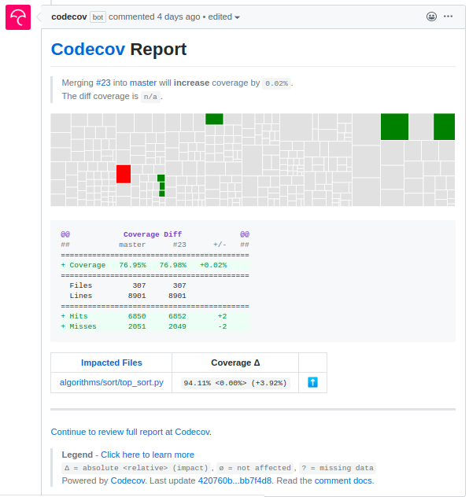
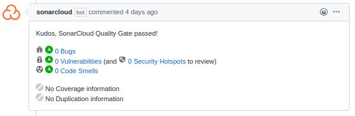
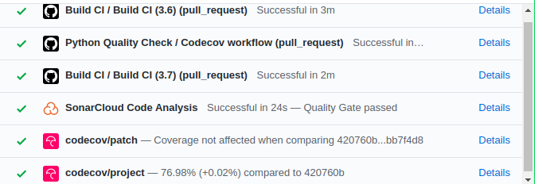

# Technológia fókusz - CI folyamatok beüzemelése

## Automatikus build ellenőrzés
A projektünk eredetileg tartalmazott egy Travis CI-on futó automatikus build ellenőrzést. Ebben `black` és `flake8` segítségével futott egy szintaxis ellenőrzés a build előtt, majd az installálás után `tox` segítségével a tesztek is lefuttatásra kerültek. 
Úgy döntöttünk, hogy gyakorlásképp áthelyezzük ezt a workflow Github Actions-ök közé, illetve kis utánaolvasással után az interneten is több cikket találtam arról, hogy a GH Actions gyorsabb, mint a Travis CI (ez egyébként be is bizonyosodott, amíg párhuzamosan lefutott a két workflow, addig a GH Action már majdnem teljesen lefutott, mire a Travis CI elindult. )

Létrehozott fájl: `.github/workflows/build_workflow.yml`

## Automatikus tesztelés, kódlefedettség ellenérzés
Bár az automatikus build ellenőrzés csinál egy teszt futtatást, de ez nem végez kódlefedettség ellenőrzést. Ezért létrehoztunk egy GH Action-t, ami ezt ellenőrzi, és a [Codecov](http://codecov.io) segítségével vizualizálja is az eredményeket.
Ebben a workflowban, először `pytest` segítségével lefuttatja a teszteket, illetve egy `./coverage.xml` fájlba kimenti a kódlefedettség eredményeket. A következő lépésnél ezt az xml fájlt feltölti a Codecov rendszerbe, ami megkezdi a kiértékelését és vizualizációját. Sajnos ez egy egészen lassú folyamat, van hogy 40 perc is szükséges ahhoz, hogy eredménye legyen. Amikor ez végzett, egy kommentként teszi közzé az ereményeit a pull requestnél, illetve a honlapján is meg lehet nézni több féle diagrammon ábrázálolva is. 

Létrehozott fájl: `.github/workflows/main.yml`

## Statikus kódminőség ellenőrzés SonarCloud-dal
Ehhez az ellenőrzéshez hozzáadtuk a SonarCloud alkalmazást a repository-hoz, és ez automatikusan futtatja a kódminőségellenőrzést a fájlokon. Az eredményét megnézhetjük a [SonarCloud honlapján](http://sonarcloud.io), illetve a Pull requesteknél kommentben is közzéteszi. 

## PR ellenőrzések:
