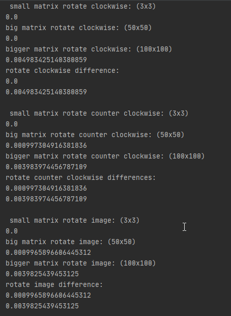
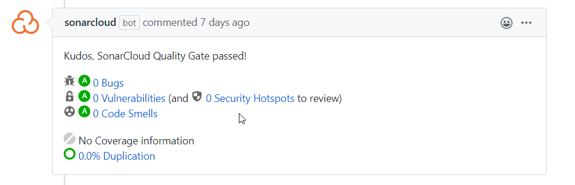

# Termék/felhasználó fókusz
# Volume testing

## A projekt matrix könyvtárában lévő néhány fájl függvényeinek teljesítményét teszteltem. A függvényeknek kicsi és nagy bemenetet adtam és megnéztem a lefutási időket.

A tesztből kiderül, hogy a leglassabb függvény az mátrix inverz alkotás. 
A függvénynek már egy 10x10-es mátrix lefuttatása is gondot okoz.
Hogy a teszt emberi időben működő képes legyen, egy 6x6-os és egy 10x10-es mátrixal hasonlítottam össze az eredeti 3x3-ast. 
Már így is jól látszik az időkülönbség.

A második leglassabb a mátrix szorzás függvénye. 
Annak egy 30x30-as és egy 50x50-es mátrixot adtam, ahhoz, hogy jól kivehető legyen a különbség a kisebb 3x3-as mátrixal szemben.

A többi függvény (csak formázáshoz használható függvények) még 50x50-es illetve 100x100-as mátrixoknál is nehezen észrevehető időkülönbségekkel működnek.

Innen is látszik, hogy mennyivel idő és teljesítmény igényesebbek a mátrix szorzás és az inverz képzés műveletei.

Létrehozott fájl: `.tests/test_volume_matrix.py`

Először csak egy nagyobb függvényel vizsgáltam a különbséget, de Südi Beáta tanácsára mindegyik teszthez hozzáadtam még egy még nagyobb mátrixot, és így tényleg nagyon szépen látszanak már a függvények teljesítményei. 

A másik problémám a kód duplikációval akadt, de miután a teljes mátrixokat kicseréltem generáló függvények segítségével, már ez sem okozott problémát. Végül a SonarCloud sem jelzett hibát:

