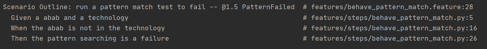
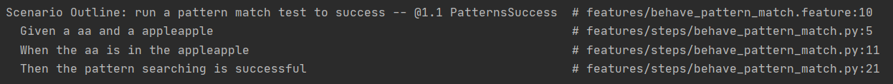
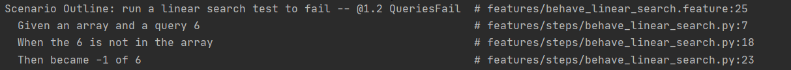
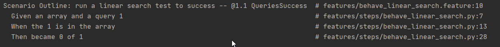
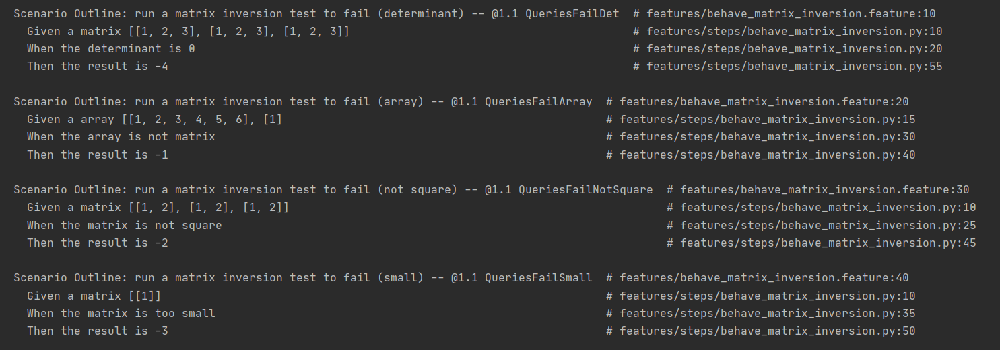
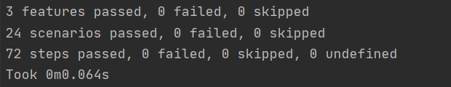
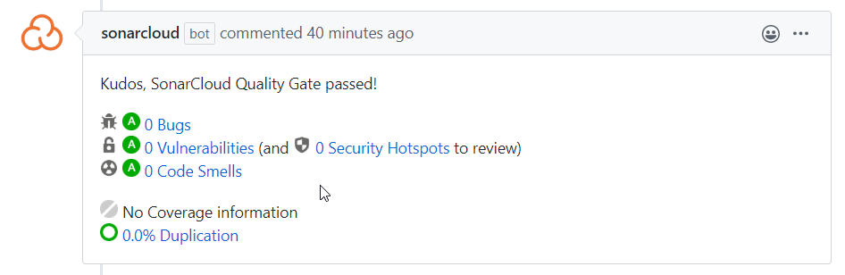

# Termék/felhasználó fókusz
# BDD testing

## A unit teszteken kívül is léteznek tesztelési lehetőségek, például a BDD (Behavior-Driven Development) tesztek, amik függvények viselkedését elemzik. Ezzel a módszerrel egy kicsit máshogy, másfajta hibákat fedezhetünk fel. 

Miután alaposan utána jártam a BDD tesztelés működésének, letöltöttem a behave libaryt. (https://behave.readthedocs.io/en/latest/)

3 függvényt választottam, amikhez tesztet írtam: _matrix_inversion.py_, _pattern_match.py_ és a _linear_search.py_.

## A viselkedésüket vizsgáltam, hogy hogyan reagálnak a függvények helyes illetve hibás bemenetekre.

A _pattern_match.py_ és a _linear_search.py_ függvényeknek hibás és helyes bemeneteket is megadtam. A helyes bemenetre a ellenőriztem, hogy a helyes kimenetet adják-e vissza. A hibás bemenetre pedig, hogy a megfelelő hibával térnek-e vissza. 

A _matrix_inversion.py_ függvénynek csak hibás bemeneteket adtam meg, és azt vizsgáltam, hogy a megfelelő hiba üzenetet adja-e vissza. Mivel a megfelelő bemenetre adott válasz mátrixot már unit teszt ellenőrzi. 

A tesztek írásához alaposan meg kellett ismernek a működésüket, viselkedésüket, hogy olyan bemeneteket tudjak adni, ami a megfelelő hatást éri el.

Mivel a projektünk egy libary, így a működése nem olyan komplex, nincsenek komplex kapcsolatok a függvények között. Ez a tesztelési módszer sokkal több értelmet nyerne egy komplexebb program vizsgálata során. 

Létrehozott fájlok: 
- `.features/behave_linear_search.feature`
- `.features/behave_pattern_match.feature`
- `.features/behave_matrix_inversion.feature`
- `.features/steps/behave_linear_search.py`
- `.features/steps/behave_pattern_match.py`
- `.features/steps/behave_matrix_inversion.py`

A Githubra feltöltés után az Actionok és a SonarCloud is elfogadták: 

