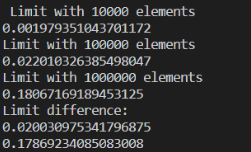
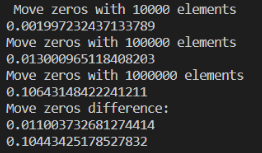
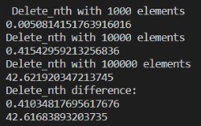

# Termék/felhasználó fókusz
# Volume testing

## Tömbökre írt algoritmusok teljesítményét teszteltem. A függvényeknek különböző méretű beneeteket adtam, majd aa futási időt vizsgáltam.

A függvények tesztelése során először kisebb méretű tömbökkel próbálkoztam, azonban így sok esetben mérhetetlen volt az eredmény. Ezek után tízezer, illetve ennél nagyobb elemszámú tömböket hoztam létre tesztelés céljából, hogy a futási idők közötti különbség megfigyelhető legyen.

### Az eredmény a következőképpen alakult:
 Az első két esetben lineáris futási algoritmusokat vizsgáltam, ezért volt szükség a hatalmas tömbökre az időkülönbségek megfigyeléséhez. A kimeneten jól megfigyelhető a bemenet méretének és a futási időnek a kapcsolata.

Ezután egy komplexebb függvényt kerestem. A delete_nth algoritmus O(n^2) komplexitású, ezt a mérési eredményeim is jól mutatják: 

