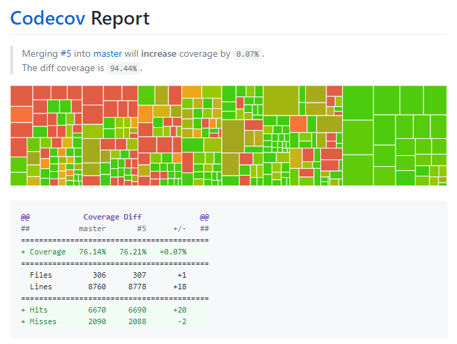

# Projekt megismerése
## Unit tesztek írása string algoritmusokhoz

A projekt README-jének elolvasása után úgy gondoltam, hogy unit tesztek írása által próbálom jobban megismerni az algoritmusokat. Mivel a library rengeteg fájlt tartalmaz, úgy gondoltam célszerű csak egy részére koncentrálni, ezért
__kiválasztottam a stringekre írt algoritmusokat.__

Ezek alaposabb átnézése után áttértem a tesztekre, ahol bár szinte minden algoritmushoz tartozott unit teszt, találtam néhány hiányosságot.

Ezek kiegészítésére létrehoztam a `.tests/test_string_algorithms.py` fájlt, amelynek tesztesetei sikeresen lefutottak.

Az általam írt tesztekkel 0.07 %-kal sikerült javítani a kódlefedettséget.

