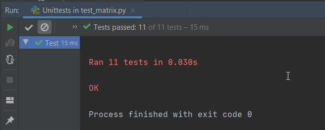

# Projekt megismerése
## Unit tesztek írása, kiegészítése (Matrix)

A projekt nagyon sok függvényt tartalmaz, így miután elolvastam a README fájlt, és felületes végig néztem a mappákat és az egyes fájlokat, kiválasztottam egy elkülöníthető funkciót.

### Én a mátrixokkal foglalkozó függvényeket választott. (`.algorithms/matrix/`)

Elősör átnéztem a mappa fájljait, végig jártam a függényeket. Ezek után megnéztem a hozzá tartozo unit teszteket is. (`.tests/test_matrix.py`)

Egyes teszt eseteket hiányosnak ítéltem meg, mivel csak egy-egy bementet tesztelnek, így arra jutottam, hogy a kiegészítésük során még jobban megismerhetem a funkciókat. 

A kiegészített tesztekket együtt lefuttattam a fájl ellenőrzését, és az új teszteset is hiba nélkül lefordultak.

